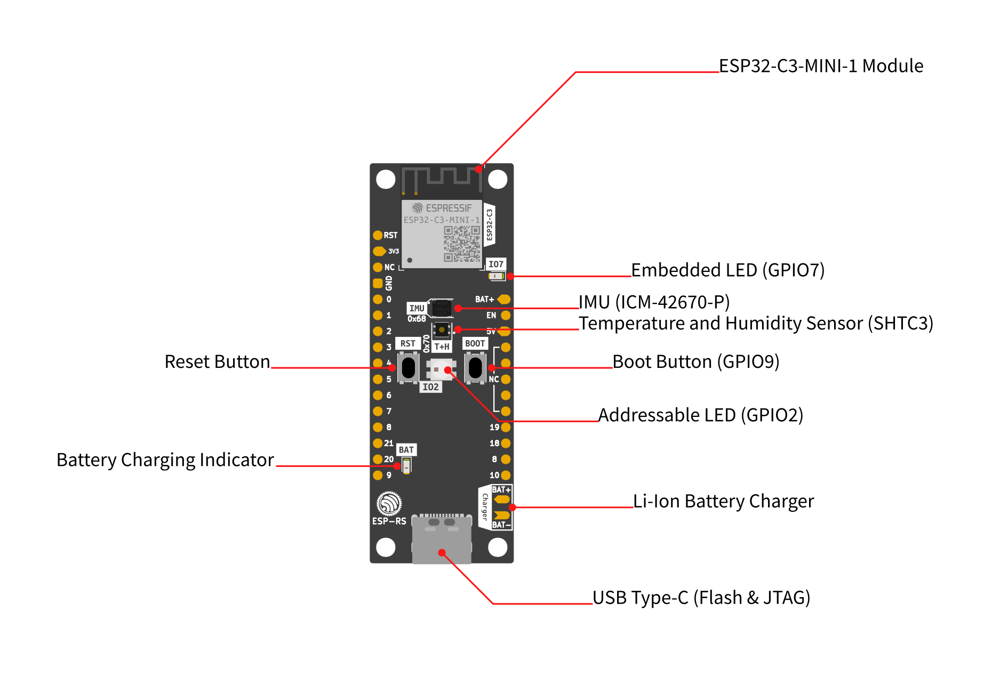

# Esp32c3 Devkit Demo

## Overview

This project is an example of how to set up the [board](https://github.com/esp-rs/esp-rust-board) using Embassy and its onboard sensors.  It is provided as an educational example of one way to set up a medium complexity embedded project
with multiple async tasks talking to hardware.

This board is a good candidate for learning as it has an onboard IMU, RGB LED and Ambient Temperature & Humidity sensor
as well as a BLE & WiFi chip and a built in debugger for easy flashing and reading of the trace.

## Getting Started

Install Rust

```bash
curl --proto '=https' --tlsv1.2 -sSf https://sh.rustup.rs | sh
```

install the chip's toolchain:

```bash
rustup target add riscv32imc-unknown-none-elf
```

install the flashing tool:

```bash
cargo install cargo-espflash espflash
```

Build and flash the chip over USB with:

```bash
cargo run --release
```

or any of the examples with:

```bash
cargo run --release --example <example_name> # i.e. cargo run --release --example led
```



---

Bootstrapped from [esp-generate](https://github.com/esp-rs/esp-generate) template.
